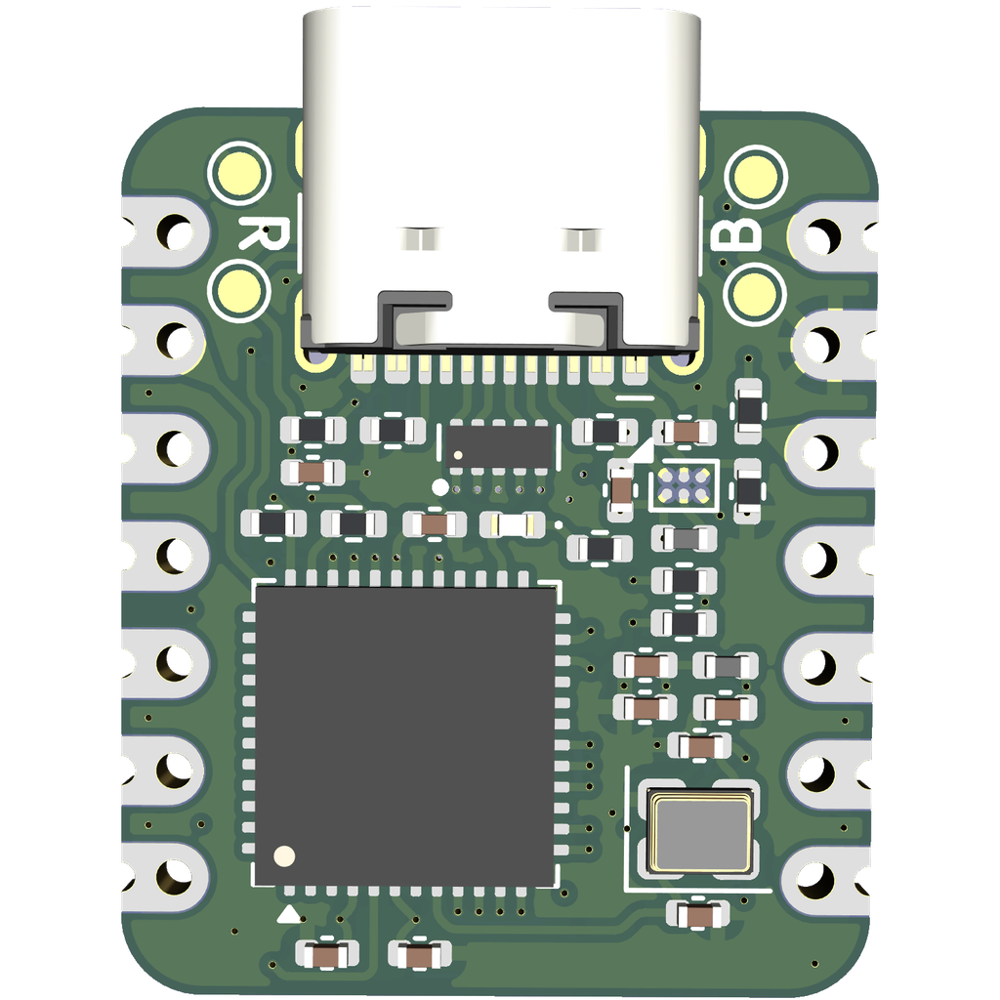
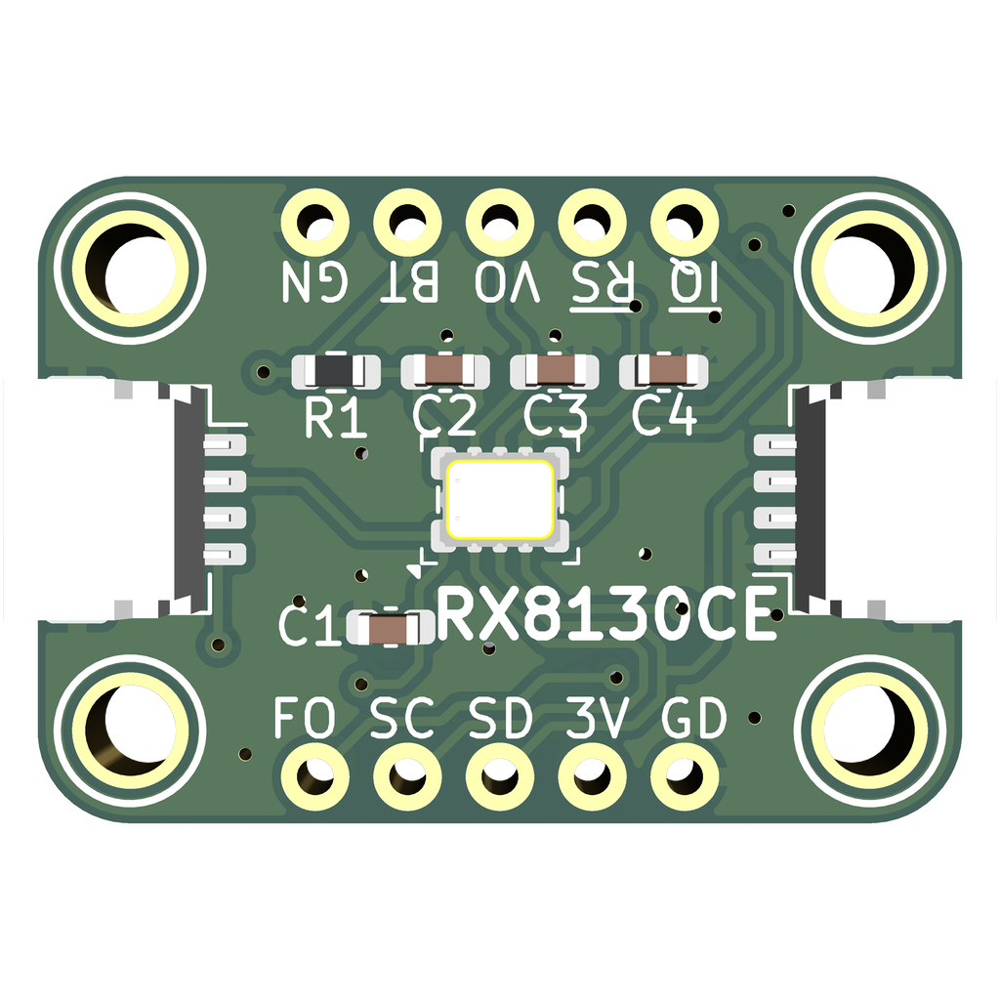

# Sandbox

Various playthings :)

| | | |
|:--- |:---:|:--- |
| small-stm32 |  | STM32 based Seeed XIAO footprint module |
| `RX8130CE` |  | EPSON RX8130CE RTC QWIIC / STEMA-QT Module |
| ~~`DRV2605L`~~ | :x: | *Already commercially available [Sparkfun](https://www.sparkfun.com/sparkfun-haptic-motor-driver-drv2605l.html) ([source](https://github.com/sparkfun/Haptic_Motor_Driver)), and [Adafruit](https://www.adafruit.com/product/2305).* |

<!--
| `MCP3221`/`MCP3201` |||
-->